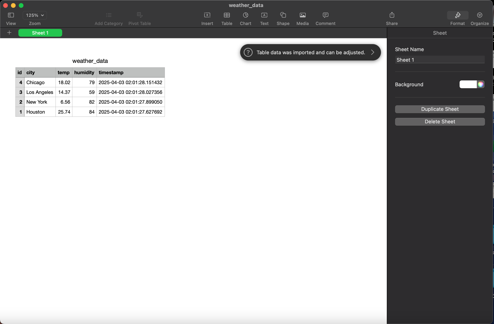

# Weather Data ETL Pipeline

A complete Python-based ETL project that fetches real-time weather data from the OpenWeatherMap API, stores it in a PostgreSQL database, and provides tools for querying, reporting, CSV exporting, and automated daily updates.

## Features

- Fetches current weather data for multiple cities
- Stores historical data in PostgreSQL
- Displays average temperature and humidity by city
- Exports data to CSV
- Automated daily updates using a Python scheduler

## Tech Stack

- **Python**
- **PostgreSQL**
- **Pandas**
- **OpenWeatherMap API**
- **Schedule** (Python library)

## Project Structure
weather-etl-project/
├── weather_etl.py         # Main ETL script (Extract, Transform, Load)
├── query_weather.py       # Displays average weather data
├── export_to_csv.py       # Exports database data to CSV
├── scheduler.py           # Schedules automatic daily data pulls
├── .gitignore
├── README.md
└── venv/                  # Virtual environment (ignored in Git)

## Setup Instructions

1. **Clone the repo**
2. **Create a PostgreSQL database** named `weather_db`
3. **Get your OpenWeatherMap API key** and add it to `weather_etl.py`
4. **Run scripts:**
   - `weather_etl.py`: Fetch and store new weather data
   - `query_weather.py`: View average temp and humidity
   - `export_to_csv.py`: Export weather records to a `.csv` file
   - `scheduler.py`: Automatically run the ETL process daily at 8:00 AM

## Author

**Moustafa Ragheb**  
[GitHub](https://github.com/Mouragheb)  
[LinkedIn](https://www.linkedin.com/in/moustafa-ragheb-7b474aa6)  
[Portfolio Website](https://www.moustafaragheb.com)

## Project Screenshots

### ETL Script Running

### Weather Query Output

### CSV Export

## What I Learned

- How to structure and build a real-world ETL pipeline using Python
- How to connect to external APIs and handle real-time data
- How to store, query, and analyze data using PostgreSQL
- How to export structured data to CSV for external use
- How to automate daily data jobs using Python scheduling tools
- How to manage sensitive credentials securely with `.env` files
- How to organize and present a technical project professionally on GitHub